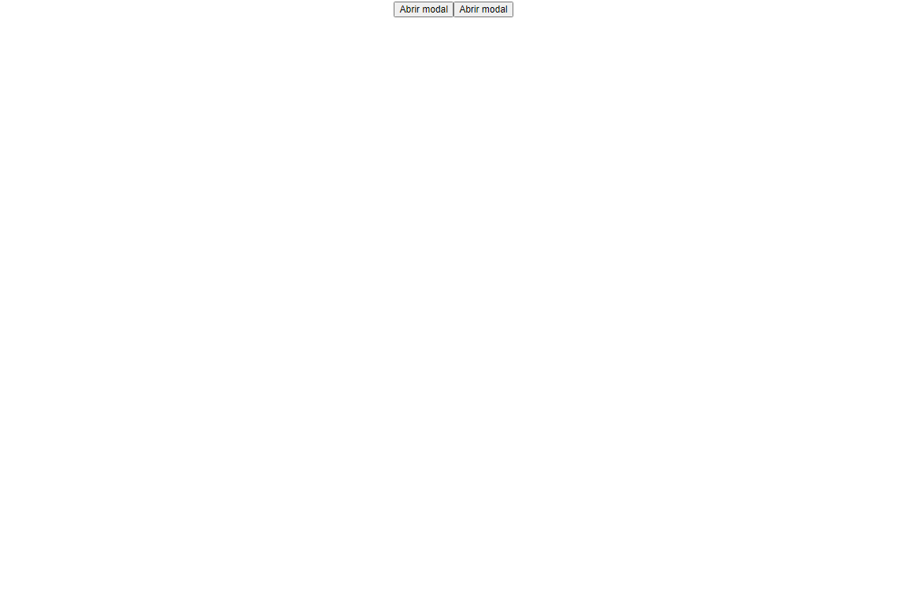
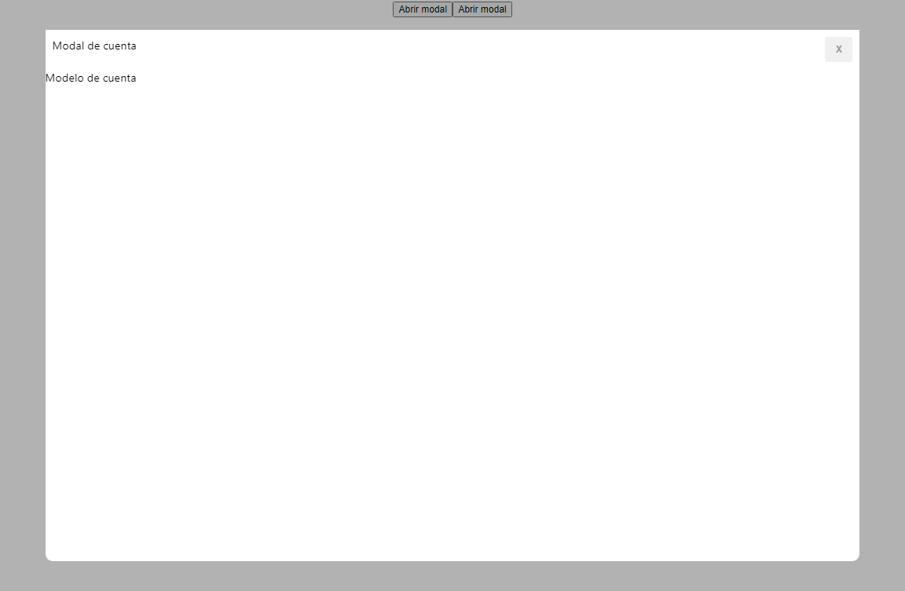
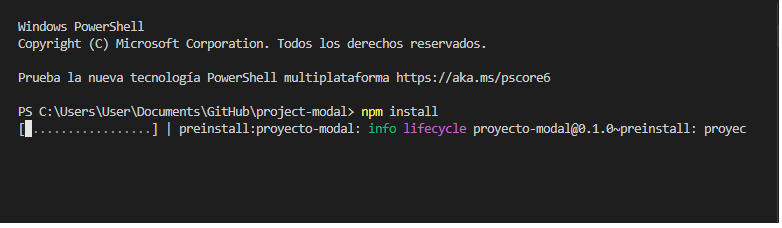
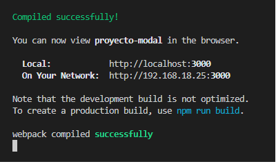
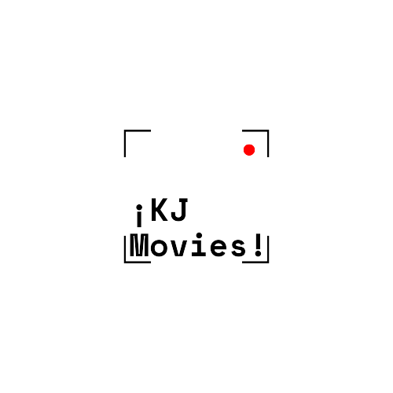

# Welcome to the Modal Page (DEMO)!📄📑
An application whose purpose is to create different types of modules, reducing the size of the main bundle, only when necessary  
Its main functionality is to pack our application with Lazy Loading as well as Suspense which allows us to display content while it is downloaded.

# Steps to run the project 🚨:

  
  
  

1.- Once the project is downloaded, access the terminal of your console.

    * - To access open the terminal (Control + Ñ) or (Terminal - New Terminal).
    * - Run the command "npm install"
   

  

                
Once having the first step perfectly, we proceed to execute the environments

  

## More info about me: 

Ing. Kevin J. Montero Zea 

CE: 004712881 🆔

+51-913-695-382 📱

<a href="https://www.linkedin.com/in/kevin913montero/">
    LinkedIn 👨‍🦰
  </a>

<a href="https://portfoliokjmz.netlify.app/">
    Portfolio 💼
  </a>

